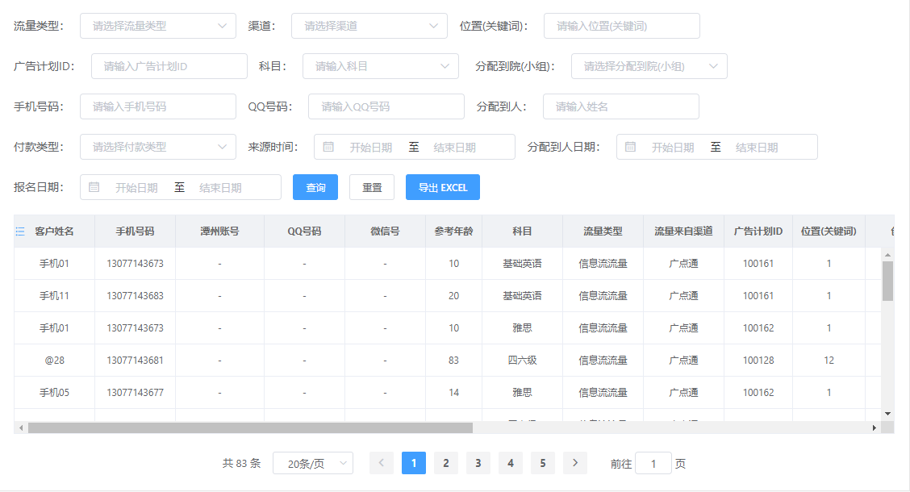
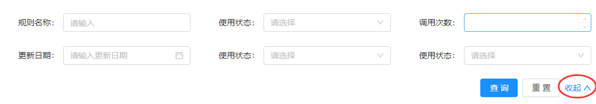

## 计划任务

- [x] 工作周报

- [x] 跟进 CRM v1.11 发布生产环境（计划发布时间 17:00）

- [x] 处理数据安全、权限方面问题，主要针对流量相关，防止被窃取泄露。

  前端修改路由的访问权限和菜单归属，后端修改接口的访问权限和数据范围。  
  需求比较紧急，预计会在下个迭代版本 v1.12 之前处理上线。

  因产品认为此问题比较严重，需要尽快做出相关修改，现计划明天上午由前端先发布菜单相关权限修改。

- [x] table 优化后问题

  在笔记本这种小屏幕下能看到的数据量特别少，同样影响到用户体验，需确定方案解决。

  

  跟产品协商后，确定将查询项进行优化处理，减少默认展示的查询项，通过 展开/收起 的交互处理，会在下一个迭代版本 v1.12 进行处理。

  
  

## 探索发现

- [anime](https://github.com/juliangarnier/anime/)

  > JavaScript animation engine

  应该是目前最好的 JavaScript 动画引擎

- [Node.js 最佳实践](https://github.com/i0natan/nodebestpractices/blob/master/README.chinese.md)

  每周都会增长（有活力）的 Node.js 最佳实践内容总结和分享

- [You-Dont-Need-JavaScript](https://github.com/you-dont-need/You-Dont-Need-JavaScript)

  看了所有示例，总的来说，纯 CSS 只能满足固定模式的效果应用，涉及到扩展或动态，还是得 JavaScript。

- [What is the difference between properties and attributes in HTML?](https://stackoverflow.com/questions/6003819/what-is-the-difference-between-properties-and-attributes-in-html)

  attributes 是 DOM 元素上显示绑定的属性集合  
  properties 是 DOM 节点对象（比如 HTMLInputElement 接口的实例），包含 attributes 属性。
