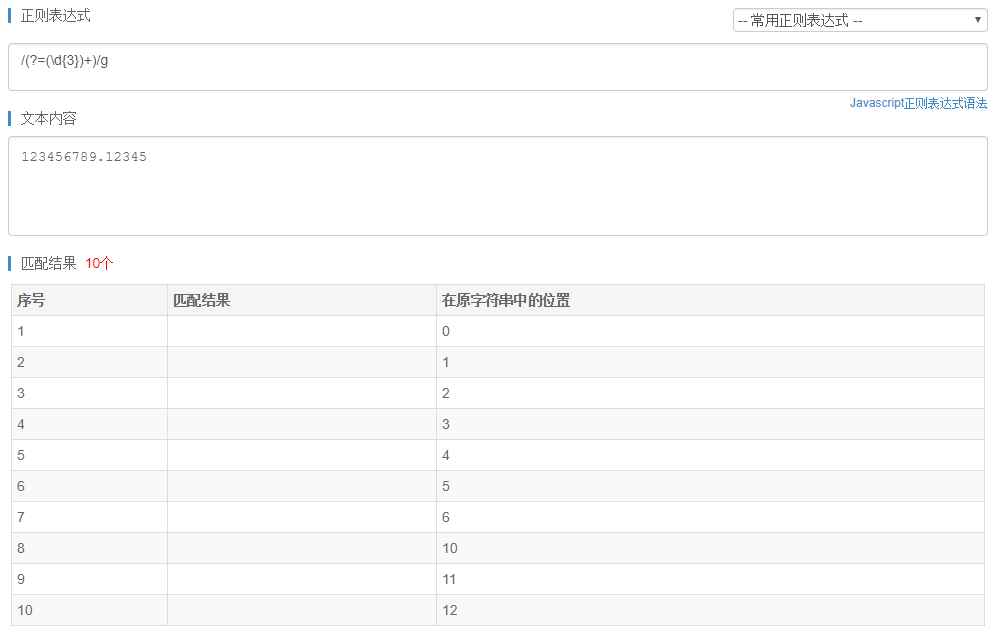
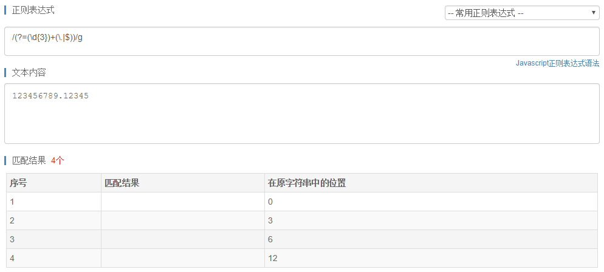
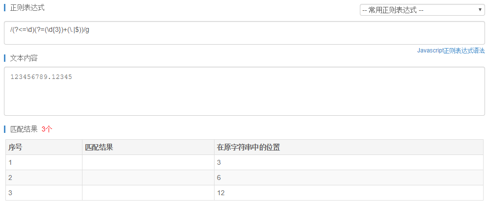
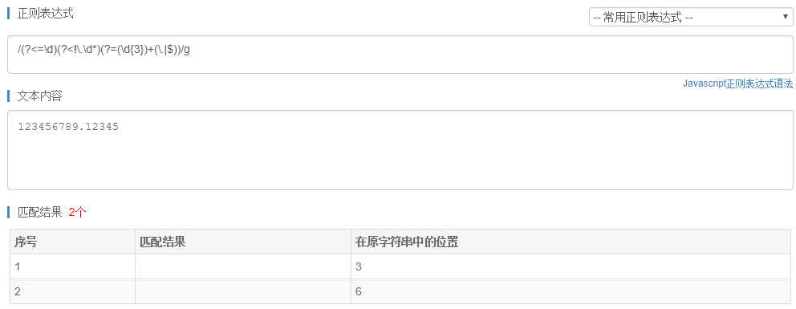

## 计划任务

* [x] 昨日紧急线上问题修复上线

* [x] 工单模块所有页面金额展示数值添加千分位逗号

	添加 vue 过滤器，再逐个页面进行修改。

	匹配千分位正则表达式：`//g`

	正则的应用没办法死记硬背，一定要理解应用规则。千分位的正则应用 **首先要明确的是匹配位置，而不是匹配内容。**  

	以 123456789.12345 为例，
	
	首先我们能写出的是 `/(?=(\d{3})+)/g`，这能够匹配出所有连续 3 位都是数字的位置。

	
	
	发现匹配的位置太多了，应该是每 3 位连续数字才匹配，而不应该是有 3 位连续数字就匹配。  
	细想发现，缺少了一个结束点，以这个结束点为界，之前的每连续 3 位数字才是有效的。当没有小数的情况下，每连续 3 位数字后面应该是结束符 `$`；而当有小数的情况下，每连续 3 为数字后面也可能是小数点 `.`。  
	所以添加相关条件后的正则是：`/(?=(\d{3})+(\.|$))/g`

	

	发现匹配到了第 0 位，还要添加不匹配第 0 位的条件。不要从正则表达式的语法上思考，而应该从模式上思考，第 0 位有什么特性？第 0 位前面没有任何内容。再反向思考，也就是说，连续 3 位数字的前面必须是数字。  
	所以添加相关条件后的正则是：`/(?<=\d)(?=(\d{3})+(\.|$))/g`

	

	成功移除第 0 位，但还不够，上图还有第 12 位被匹配到，也就是小数部分也被匹配了。从模式上思考，怎么定义小数部分？前面有小数点 `.` 就是小数部分。也就是说，连续 3 位数字的前面不能出现小数点 `.`。  
	所以添加相关条件后的正则是：`/(?<=\d)(?<!\.\d*)(?=(\d{3})+(\.|$))/g`

	

	最后，使用 `replace` 方法，将匹配到的位置替换成逗号 `,`。

	```js
	'123456789.12345'.replace(/(?<=\d)(?<!\.\d*)(?=(\d{3})+(\.|$))/g, ',') // "123,456,789.12345"
	```

	大功告成，然而后来我又发现一个 [API `Number.prototype.toLocaleString()`](https://developer.mozilla.org/en-US/docs/Web/JavaScript/Reference/Global_Objects/Number/toLocaleString)，以前真的没见过...💀

* [x] CRM v1.15 测试用例评审
