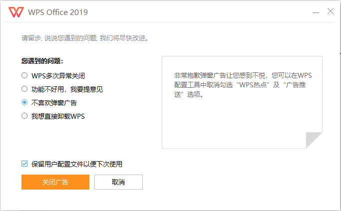
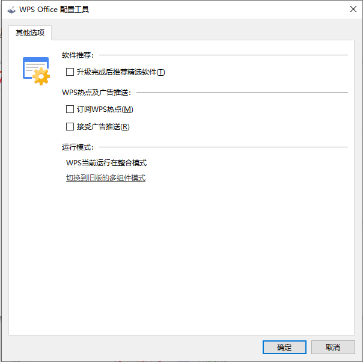

## 计划任务

* [x] 2 月份目标计划表

* [x] 工作周报

* [x] 跟进工单项目 v1.15

	另外让 @巧云 @三炮 将页面的魔法数字全部替换掉

## 阅读思考

* [Rendering on the Web](https://developers.google.com/web/updates/2019/02/rendering-on-the-web)

	1. Server Rendering（服务端渲染）

		> Server rendering generates the full HTML for a page on the server in response to navigation. This avoids additional round-trips for data fetching and templating on the client, since it’s handled before the browser gets a response.

		服务端渲染为在服务器上生成完整的 HTML 以响应导航（页面请求），这避免了在客户端上进行数据获取和模板化的额外往返，因为它是在浏览器获得响应之前处理的。

		> generating pages on the server takes time, which can often result in a slower Time to First Byte (TTFB).

		在服务器上生成页面需要时间，这通常会导致较慢的 TTFB（客户端接收到来自服务端响应的第一个字节的时间）。

	2. Static Rendering（静态渲染）

		> static rendering means producing a separate HTML file for each URL ahead of time.

		静态渲染意味着提前为每个 URL 生成单独的 HTML 文件，

		> One of the downsides to static rendering is that individual HTML files must be generated for every possible URL. This can be challenging or even infeasible when you can't predict what those URLs will be ahead of time, or for sites with a large number of unique pages.

		静态渲染的一个缺点是必须为每个可能的 URL 生成单独的 HTML 文件，如果无法提前预知这些 URL，或者对于具有大量唯一页面的网站，这具有挑战性甚至是不可能的。

		> it’s important to understand the difference between static rendering and prerendering: static rendered pages are interactive without the need to execute much client-side JS, whereas prerendering improves the First Paint or First Contentful Paint of a Single Page Application that must be booted on the client in order for pages to be truly interactive.

		理解静态渲染和预渲染之间的区别非常重要：静态渲染页面是交互式的而无需执行更多客户端 JS，而预渲染改进了必须在客户端上启动的单页应用程序的 First Paint 和 First Contentful Paint 使页面具有真正交互性。

	3. Client-Side Rendering (CSR)（客户端渲染）

		> Client-side rendering (CSR) means rendering pages directly in the browser using JavaScript. All logic, data fetching, templating and routing are handled on the client rather than the server.

		客户端渲染意味着使用 JavaScript 直接在浏览器中渲染页面。所有逻辑，数据获取，模板和路由都在客户端而不是服务器上处理。

		> The primary downside to Client-Side Rendering is that the amount of JavaScript required tends to grow as an application grows.

		客户端渲染的主要缺点是随着应用程序的增长，所需的 JavaScript 数量会增加。

	4. Combining server rendering and CSR via rehydration

		> Navigation requests like full page loads or reloads are handled by a server that renders the application to HTML, then the JavaScript and data used for rendering is embedded into the resulting document. When implemented carefully, this achieves a fast First Contentful Paint just like Server Rendering, then “picks up” by rendering again on the client using a technique called (re)hydration. 

		整页加载或重新加载等导航请求将在服务端处理呈现应用程序为 HTML，然后将用于渲染的 JavaScript 和数据嵌入到生成的文档中。当仔细实现时，这就像服务器渲染一样实现了快速的 First Contentful Paing。

		最后一句不太理解，不知如何翻译。我心中的意思是：通过 (re)hydration 的技术在客户端重新渲染，但 (re)hydration 到底如何理解？

	5. Streaming server rendering and Progressive Rehydration

		> Streaming server rendering allows you to send HTML in chunks that the browser can progressively render as it's received.

		流式服务渲染允许你以块的形式发送 HTML，浏览器可以在接收时同步呈现。

	最后上一张所有渲染模式对比图：
	
	*图片来源 - https://developers.google.com/web/updates/2019/02/rendering-on-the-web*

## 探索发现

昨天在喜马拉雅听书采采的段子频道听闻如何去掉 WPS 广告，今天尝试一下。

1. 卸载 WPS

	选择 “不喜欢弹窗广告”，橙色按钮文字会变为 “关闭广告”。

	

2. 点击 “关闭广告” 按钮

	会弹出 WPS Office 配置工具窗口，取消所有勾选，点击 “确定” 按钮，会回到卸载 WPS 窗口。

	

3. 点击 “已完成”，结束。

666666666666666666...

## 人生感悟

我们需要拥有 **找事情做的能力**

偶尔工作任务清闲，很多小伙伴就无所事事，或者说不知道干啥，真让人着急。自身的问题，项目的问题，都不去想，不去主动发现、思考、解决。不是发现不了，真实不用心，这样如何让别人对你引起重视？如何体现自身价值？
