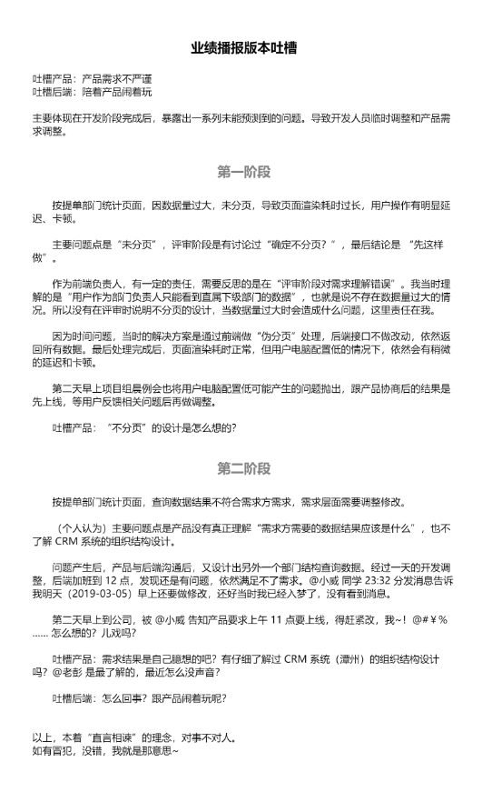

## 计划任务

- [x] 按提单部门分成页面新改动需求

  这个页面的需求已经改过好几遍了，今天还要求上午 11 点上线，很烦。  
  因为这个页面的部门级联组件跟现有部门级联组件需求不一致，如果使用现有部门级联组件兼容，时间上来不及。只能暂时基于页面新写一个组件，老组件的兼容放到之后再去修改。

- [x] 3 月份月度绩效考核表

  3 月份开发任务梳理、分配

## 临时任务

- [x] 吐槽业绩播报版本

  
