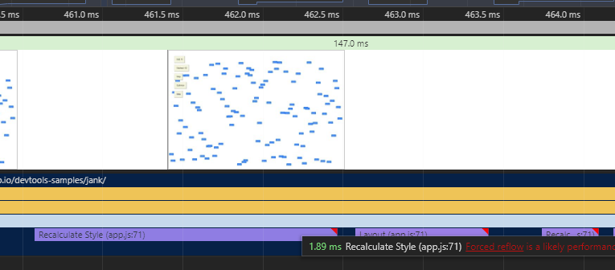
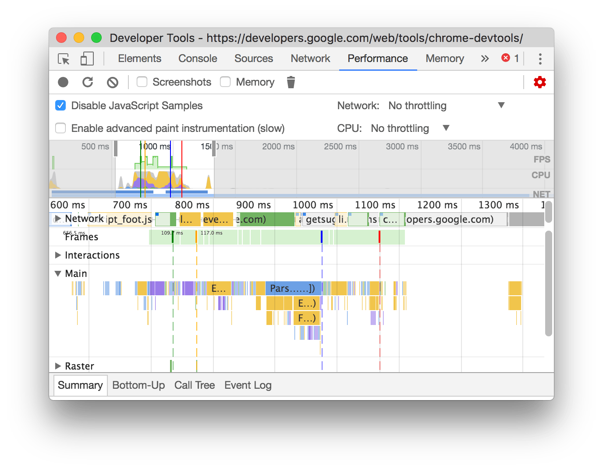
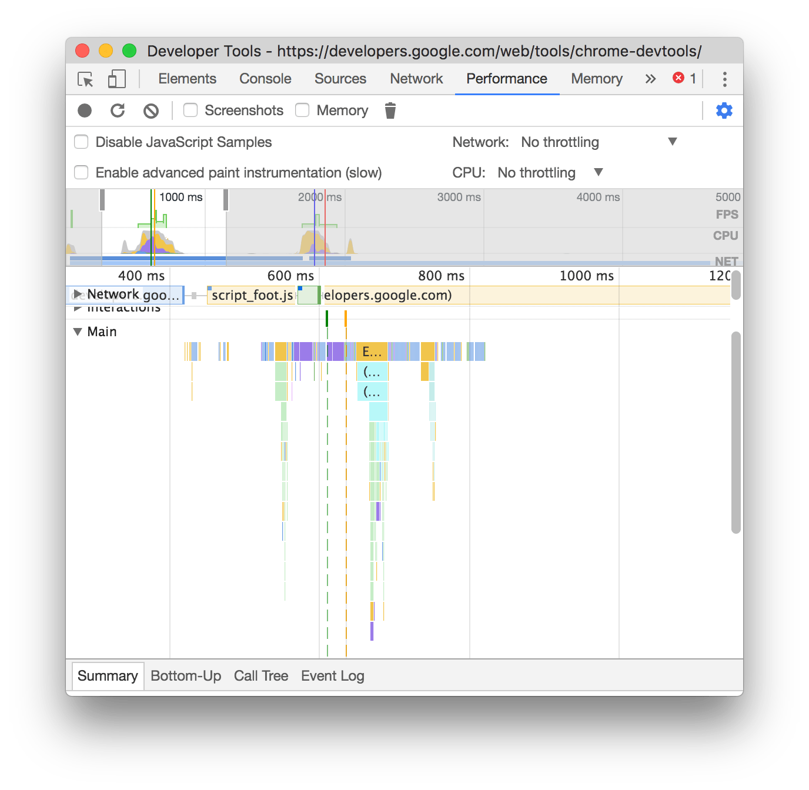

## 计划任务

- [x] CRM v1.15 二次评审

- [x] 周报

- [x] 尝试调整 CRM 项目结构

  从去年 CRM 和 工单 两项目合并，就说还是会拆分，并且拆的更细。CRM、流量、工单、售后... 但时间都半年了，还是没有任何迹象表明拆分。  
  目前的项目结构、开发模式有些麻烦，所以还是想要整合到一个项目，只是项目内容进行拆分。

## 阅读思考

### [分析运行时性能](https://developers.google.com/web/tools/chrome-devtools/rendering-tools/)

这是一篇概览，简述了常见的性能问题，以及分析工具和策略。

> #### TL;DR
>
> - 不要编写会强制浏览器重新计算布局的 JavaScript。将读取和写入功能分开，并首先执行读取。
> - 不要使您的 CSS 过于复杂。减少使用 CSS 并保持 CSS 选择器简洁。
> - 尽可能地避免布局。选择根本不会触发布局的 CSS。
> - 绘制比任何其他渲染活动花费的时间都要多。请留意绘制瓶颈。

> 一般的经验法则是，如果在帧完成前从 DOM 请求返回几何值，您将发现会出现“强制同步布局”，在频繁地重复或针对较大的 DOM 树执行操作时这会成为性能的大瓶颈。

这里不太理解 “帧完成前” 的含义，能够明白的是在此期间，获取、改变 DOM 元素的几何值，比如位置、宽高、字体大小，会造成 “强制同步布局”，也就是 “重流” 的意思吧。

Chrome DevTools Timeline 紫色 layout 部分，右上角如有红色三角标记表示会导致强制同步布局。

### [Performance Analysis Reference](https://developers.google.com/web/tools/chrome-devtools/evaluate-performance/reference)

#### Disable JavaScript samples

Chrome DevTools > Performance > Capture settings > Disable JavaScript Samples  
 勾选表示不在 Main seciton 显示详细 JavaScript 调用栈，对比如如下：

  
 An example of a recording when JS samples are disabled

  
 An example of a recording when JS samples are enabled

#### Search activities

在 Chrome DevTools > Performance 按 Command+F (Mac) 或者 Control+F (Windows, Linux)
