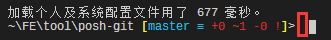
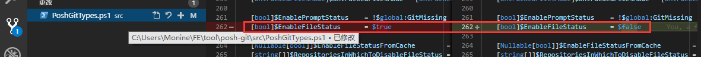

## 计划任务

- [x] CRM v1.15.1 需求评审

  主要内容为针对未成年用户流量的分配

- [x] 调整项目结构

## 今日概览

记录之前安装 posh-git 遇到的问题和解决方式  
安装 posh-git 后，终端会默认显示的信息内容包含分支名称和改动信息：  
![C:\Users\Keith\GitHub\posh-git [master ≡ +0 ~1 -0 | +0 ~1 -0 !]>](./assets/PromptDefaultLong.png)  
在 vscode 终端面板显示会导致一个小问题，光标位置与内容位置不一致:  
  
这个问题说大不大，但挺烦人的，后来实在受不了，还是得想办法解决。  
后来发现在没有任何修改的 git repository 中，刚打开 vscode 终端时光标位置与内容位置是正确的，与有问题的情况不同点是没有后面的文件内容改动信息。我好像也并没有对文件内容修改信息展示的必要需求，相比拥有正确的光标位置，我更需要后者。  
  
不显示文件内容改动信息在官网有配置说明，但因为我是通过 git repository 下载源码，运行 install.ps1 安装的，所以配置文件 profile.ps1 我并不知道应该放哪。后来不断尝试，发现直接修改源码配置貌似更方便：  

