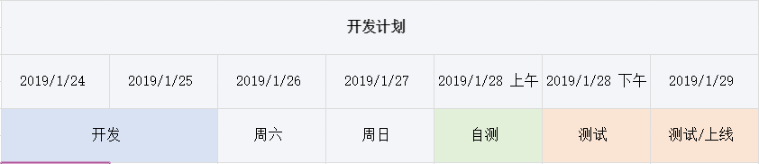
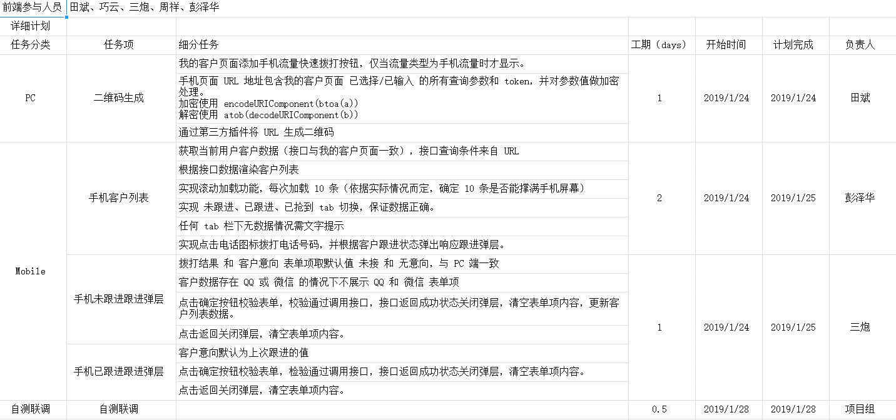

## 工作计划

- [x] 完成 CRM v1.13 前端任务计划排期和功能分解

	
	

- [x] 完成工单 v1.14 前端任务计划排期

	已交由 @巧云 处理

## 每日阅读

- [大前端时代安全性如何做](https://segmentfault.com/a/1190000017899193)

	以前爬 58 同城手机号码数据的时候就发现接口数据跟页面数据不一致，现在知道是为啥啦。

- [JavaScript Modules: From IIFEs to CommonJS to ES6 Modules](https://tylermcginnis.com/javascript-modules-iifes-commonjs-esmodules/)

	看完我又回顾了一下自己以前写的文章 [从简单的例子看 webpack 模块加载机制及思考原理](https://github.com/Monine/monine.github.io/issues/25)

	CommonJS 模块与 ES6 模块机制的区别是：  
	1. CommonJS 模块输出值的拷贝，ES6 模块输出值的引用；
	2. CommonJS 模块是运行时加载，ES6 模块是编译时输出接口。

- [Animating URLs with Javascript and Emojis](http://matthewrayfield.com/articles/animating-urls-with-javascript-and-emojis/)

	利用 url hash 和 Emoji 做动效，挺好玩的。

- [利用剪切板JS API优化输入框的粘贴体验](https://www.zhangxinxu.com/wordpress/2018/09/js-clipboard-api-paste-input/)

	增强体验用户复制粘贴行为，比如移除前后空格。  
	粘贴的内容带有自定义版权信息
